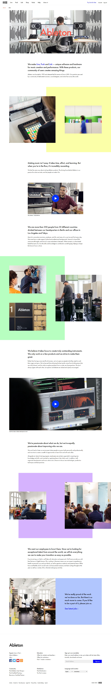

# Ableton Website Recreation

This is the recreation of the [Ableton website](https://www.ableton.com/en/) using React. This is also a challenge from [Frontend Practice](https://www.frontendpractice.com/)

## Getting Started

### Prerequisites

-   Node.js
-   npm or yarn

### Installation

1. Clone the repository:
    ```bash
    git clone https://github.com/JosueDeLosSantos/Ableton-Website-Recreation.git
    ```
2. Navigate to the project directory:
    ```bash
    cd Ableton-Website-Recreation
    ```
3. Install dependencies:
    ```bash
    npm install
    ```

### Running the Application

1. Start the development server:
    ```bash
    npm run dev
    ```
2. Open your browser and navigate to `http://localhost:5173`.

This website is fully responsive.

## Reference image


